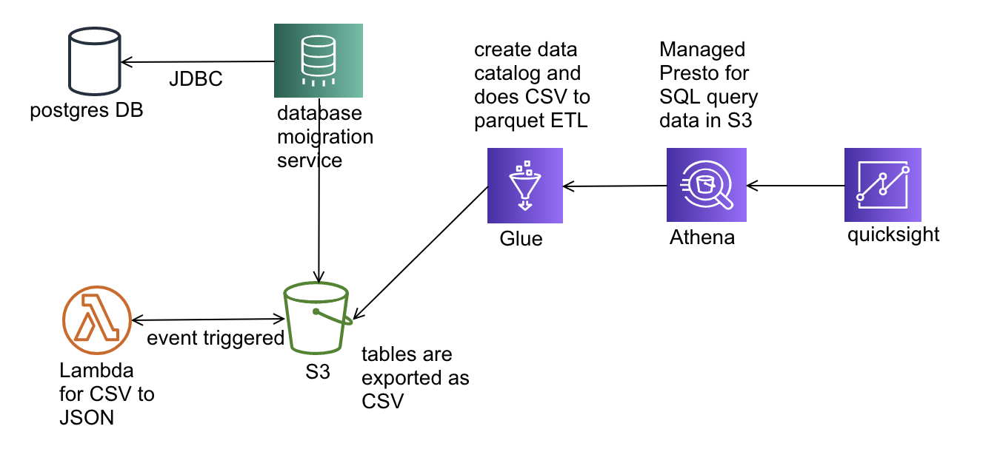
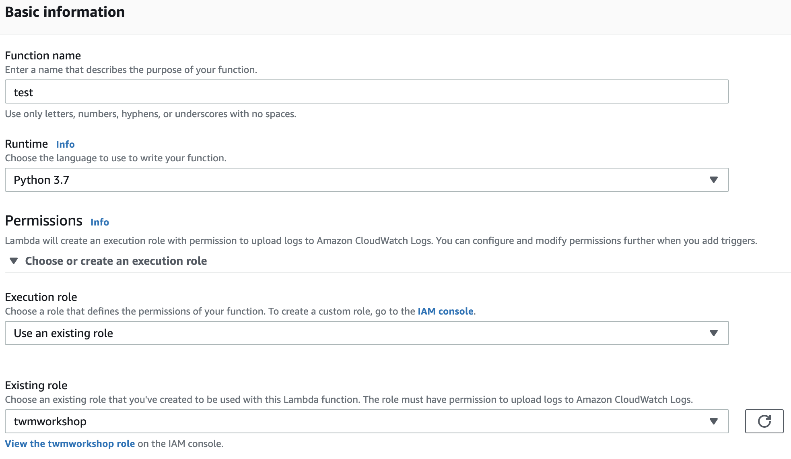
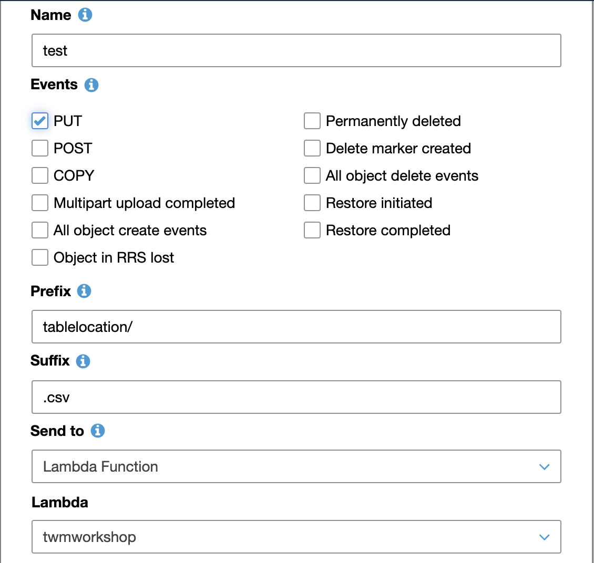

# Serverless Analytic Workshop 
## Architecture overview


## Create S3 bucket
1. in s3 console click create bucket, select the region you want and provide a name

## Lambda permission setup
1. in IAM console, click roles -> create role
2. in 'create role' console, select 'lambda' and click 'next: permission'
3. in 'Attach permissions policies', select AmazonS3FullAccess for the ease of the workshop. skip tag and give this role a name.

## Lambda function for CSV to JSON
1. create a lmabda function with below setting, and click create

2. paste code below, you would need to replace targetbuck and csv key to your own bucket and object keyname

```python
import csv
import json
import boto3

def lambda_handler(event, context):
    print("Received event: \n" + str(event))
    targetbucket = event['Records'][0]['s3']['bucket']['name']
    csvkey = event['Records'][0]['s3']['object']['key']
    jsonkey = csvkey.replace('csv', 'json')

    s3 = boto3.resource('s3')
    csv_object = s3.Object(targetbucket, csvkey)
    csv_content = csv_object.get()['Body'].read().splitlines()
    s3_client = boto3.client('s3')
    l = []
    for line in csv_content:
        x = json.dumps(line.decode('utf-8')).split(',')
        mlb_id = str(x[0])
        mlb_name = str(x[1])
        mlb_post = str(x[2])
        mlb_team_long = str(x[4])
        bats = str(x[5])
        throws = str(x[6])
        y = '{ "mlb_id": ' + mlb_id + '"' + ','  \
            + ' "mlb_name": ' + '"' + mlb_name + '"' + ',' \
            + ' "mlb_post": ' + '"' +  mlb_post + '"' + ',' \
            + ' "mlb_team_long": ' + '"' +  mlb_team_long + '"' + ',' \
            + ' "bats": ' + '"' +  bats + '"' + ',' \
            + ' "throws": ' + '"' +  throws + '"' + '}'
        l.append(y)

    s3_client.put_object(
    	Bucket=targetbucket,
    	Body= str(l).replace("'",""),
    	Key=jsonkey
    )
```
4. click save, you can test the lambda by creating a test event that use the s3 event notification format, please refer to [here](https://docs.aws.amazon.com/AmazonS3/latest/dev/notification-content-structure.html)

## S3 event notification configuration
1. in s3 console, select your bucket and select 'propoties'
2. in 'event' click add notification
	

3. upload the sample csv, you can download it [here](https://twmworkshop-neochen.s3.amazonaws.com/LOAD00000001.csv), and see the result. 

## Database preparation
1. please share your account id for instructor
2. create 1 cloud9 environment in us-east-1, and execute command 'aws s3 sync s3://dmslabstudent-dmslabs3bucket-1dlsit7mkodjy s3://<your-bucket>', the source datrabase 
3. create a iam role for glue to use later, you would need to attach managed policy 'AWSGlueServiceRole' and 'AmazonS3FullAccess' 
4. you can refer [here](https://github.com/aws-samples/aws-database-migration-samples/tree/master/PostgreSQL/sampledb/v1) for the lab postgres db description
5. if you are interested in creating your own postgres and using data migration service to export db to aws s3, please refer to full lab guide [here](https://twmworkshop-neochen.s3.amazonaws.com/twmlab.zip) 

## Glue for data catalog and ETL
1. we will use this [guide](https://twmworkshop-neochen.s3.amazonaws.com/5+-+Lab+-+ETL+With+Glue.docx) for detail glue operation

## Athena for SQL query and Quicksight for visualization
1. we will use this [guide](https://twmworkshop-neochen.s3.amazonaws.com/6+-+Lab+-+Exploring+DataLake+With+Athena+and+Quicksight.docx) for detail athena & quicksight operation.
